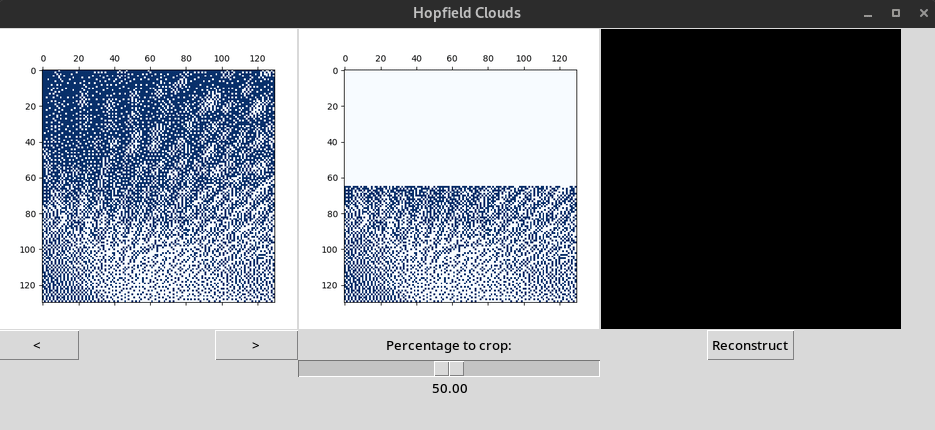

# Hopfield reconstruction

### About:

This repository contains a simple GUI application, which uses the `hopfieldnetwork` library: https://github.com/andreasfelix/hopfieldnetwork, in order to reconstruct images of clouds. Application was created by:

- Barbara Doncer - https://github.com/bdoncer
- Wojciech Dróżdż - https://github.com/behenate

### How it works

At first the network is provided with all available images of the clouds, then the user chooses which image they want to crop, after they choose how much they want to crop the image the Hopfield network will reconstruct the image based on the cropped image data.

### Demo:

